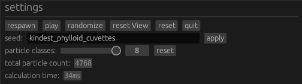
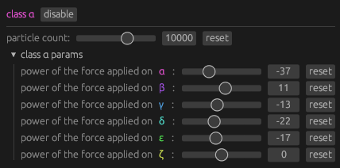
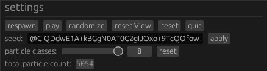

# Smarticles

This is a Rust port of [Brainxyz's Artificial Life](https://www.youtube.com/watch?v=0Kx4Y9TVMGg) simulator with some fun features.

> _A simple program to simulate primitive Artificial Life using simple rules of attraction or repulsion among atom-like particles, producing complex self-organizing life-like patterns._
>
> – from the [original repository](https://github.com/hunar4321/life_code)

It was originally created by [ChevyRay](https://github.com/ChevyRay) and improved by valflrt. Here is a preview of what the app does:

https://github.com/user-attachments/assets/26b3be2e-b9ab-4b1f-b0f3-838d1722f2d9

## Roadmap

- [x] add more particle classes
- [x] make it possible to move around and zoom
- [x] change particle interaction function (force with respect to distance)
- [x] add particle inspector that allows following a selected particle
- [x] add seed history to go back to previous seeds
- [x] add multithreading: the simulation and display threads run in parallel
- [x] Add spacial partitioning to considerably improve performance: you can now simulate thousands of particles with a decent tick rate which rarely exceeds 50ms (only in special cases where particles are gathered in groups and very close to each other)

## Running the App

To run this app, you can either download the [latest binary](https://github.com/valflrt/smarticles-fork/releases/latest) or build it yourself from source by following the instructions below.

To build the app, you will need Rust installed, which you can get by following the installation instructions on the [Rust website](https://www.rust-lang.org/). You should then have `cargo` installed, which is the command line program for managing and running Rust projects. Make sure you have the latest version.

Once done, download or clone this repository to your preferred location and run the program using `cargo` like so:

```commandline
cd ~/path/to/smarticles
cargo run -r
```

## How to use the app

Press the `randomize` button to spawn particles from a new randomized seed. Then, press the `play` button to run the simulation.

Here are the app's general controls:



Try randomizing it a few times and see what kind of results you get.

There are 8 particle types. You can change the behavior of each with respect to any other with the sliders:



Those enable you to change the `power` is the particle's attraction to particles of the other type. A positive number means it is attracted to them, and negative means it is repulsed away.

You can adjust these parameters while the simulation is running if you want to see the effect they have:

https://github.com/user-attachments/assets/75868540-8060-4c81-9e51-872ae3ef61af

## Sharing Simulations

The `seed` field enables you to share or save your favorite seeds. It contains all the information needed to replicate the current simulation.

Pressing `randomize` will give you random seeds, but you can also enter a custom one.

If you start adjusting parameters, you'll notice the seed changes to a code that begins with the `@` symbol. These are custom-encoded simulations, which you can share by copying the entire code.

The code will be partially cut-off by the textbox, so make sure you select it all before copying.



## Particle Inspector

You can inspect particles using the particle inspector.


One of the useful features it offers is following the selected particle.

## Seed History

Using seed history you can easily browse previous seeds (because losing an interesting seed because you clicked randomize too fast is painful believe me).


